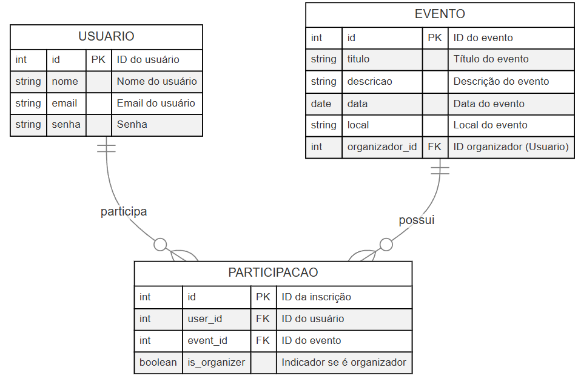

# Eventus

Eventus é um sistema web desenvolvido em Django para gerenciamento de eventos. O sistema permite a criação, edição, listagem e exclusão de eventos, além de funcionalidades de autenticação e participação dos usuários.

## 📌 Funcionalidades

- 🔹 **Autenticação de Usuário** (Login, Logout e Cadastro)
- 🔹 **CRUD de Eventos** (Criar, Listar, Editar e Deletar eventos)
- 🔹 **Gerenciamento de Participação** (Inscrição, Lista e Cancelamento de Inscrição em eventos)
- 🔹 **Sistema de Mensagens** para feedback ao usuário
- 🔹 **Proteção de Rotas** (Somente organizadores podem editar/deletar seus eventos)

## 🚀 Tecnologias Utilizadas

- **Django** (Back-end)
- **Django Authentication** (Autenticação de usuários)
- **HTML + CSS + Bootstrap** (Front-end básico)
- **SQLite** (Banco de dados padrão do Django)


## 📂 Estrutura do Projeto

```
Eventus/
│-- manage.py
│-- eventus/
│   │-- settings.py
│   │-- urls.py
│-- gerenciador_eventos/
│   │-- urls.py
│   │-- views.py
│   │-- models.py
│   │-- forms.py
|   |-- admin.py
|   |-- apps.py
|   │-- templates/
│   │   |-- principal.html
│   │   |-- login.html
│   │   |-- cadastrar.html
│   │   |-- meus_eventos.html
│   │   |-- listar_eventos.html
│   │   |-- detalhar_evento.html
│   │   |-- criar_evento.html
│   │   |-- editar_evento.html
│   │   |-- deletar_evento.html
```

### 📊 Modelo do Banco de Dados  



## 📌 Como Rodar o Projeto

### 1️⃣ Clonar o repositório
```bash
git clone https://github.com/AgostiniGuilherme/Eventus.git
cd eventus
```

### 2️⃣ Criar e ativar um ambiente virtual (opcional, mas recomendado)
```bash
python -m venv venv
source venv/bin/activate  # Mac/Linux
venv\Scripts\activate     # Windows
```

### 3️⃣ Instalar as dependências
```bash
pip install -r requirements.txt
```

### 4️⃣ Configurar o banco de dados
```bash
python manage.py migrate
```

### 5️⃣ Criar um superusuário (opcional, mas útil para testes)
```bash
python manage.py createsuperuser
```

### 6️⃣ Rodar o servidor
```bash
python manage.py runserver
```
Acesse no navegador: [http://127.0.0.1:8000](http://127.0.0.1:8000)

## 📌 Rotas Principais

| Rota | Descrição |
|------|-------------|
| `/` | Página principal |
| `/auth/cadastrar/` | Cadastro de usuário |
| `/auth/login/` | Login de usuário |
| `/auth/logout/` | Logout do sistema |
| `/meus-eventos/` | Lista eventos que o usuário participa |
| `/eventos/` | Lista todos os eventos disponíveis |
| `/eventos/criar/` | Criar um novo evento |
| `/eventos/<id>/` | Detalhes de um evento específico |
| `/eventos/<id>/editar/` | Editar um evento (somente organizador) |
| `/eventos/<id>/deletar/` | Deletar um evento (somente organizador) |
| `/evento/<id>/inscrever/` | Inscrever-se em um evento |
| `/evento/<id>/cancelar-inscricao/` | Cancelar inscrição em um evento |

## 🛠 Como Contribuir
1. **Fork** este repositório
2. Crie uma nova branch: `git checkout -b minha-feature`
3. Faça as alterações e commit: `git commit -m 'Adicionando nova feature'`
4. Envie para o repositório remoto: `git push origin minha-feature`
5. Abra um **Pull Request** 🚀

---
💡 **Eventus** - Sistema de gerenciamento de eventos desenvolvido em Django. 

© Projeto desenvolvido por Guilherme Noronha de Agostini e Gustavo Viana Avelar Dutra para a disciplina Programação Web, realizada na UFLA - Universidade Federal de Lavras.
